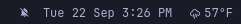

# My Weather (nicknow.weather)

An Omarchy shell bar widget that shows the current temperature right in the
status bar, next to the live weather condition icon. Left-clicking still opens
the full weather details panel (forecast, wind, humidity, location setting).

This plugin is a clone of Omarchy's built-in `omarchy.weather` widget with a
single change: where the stock widget drew only the condition icon in the bar,
this one renders **icon + current temperature** (e.g. `n  57°F`). Clicking,
right-clicking, and the detail panel behave exactly like the stock widget.

## Preview



## Requirements

- Any Omarchy install (Hyprland + Omarchy shell)

## Installation

```bash
omarchy plugin add https://github.com/nicknow/omarchy.nicknow.weather --enable
```

Enabling the plugin:

- places the widget in the bar (default section: `center`)
- disables the built-in `omarchy.weather` widget it replaces
- keeps the `omarchy weather` IPC targets routed to this widget, so
  `omarchy notification weather`, the panel toggle, and the right-click
  status notification all keep working

To move it to another bar section after install:

```bash
omarchy bar move nicknow.weather --section left
```

To update to a newer version:

```bash
omarchy plugin update nicknow.weather
```

## Removal

```bash
omarchy plugin remove nicknow.weather --yes
```

Removing the plugin also re-enables the built-in `omarchy.weather` widget, so
the weather pill and its details panel keep working as they did out of the box.

## How it works

The plugin is a clone of the stock widget. The only difference from stock is in
`BarWidget.qml`:

```qml
WidgetButton {
  id: button
  ...
  text: panelLoader.item
    ? (panelLoader.item.label + " " + panelLoader.item.reportTempNum + panelLoader.item.tempUnit).trim()
    : ""
  ...
}
```

The stock widget used a fixed-size `BarIconButton` that painted just the icon.
This widget uses a `WidgetButton` (the same text-label component the clock
widget uses) with a label composed from the icon plus the current temperature
and unit, pulling `reportTempNum` and `tempUnit` off the underlying weather
panel.

The manifest keeps `omarchy.clonedFrom: "omarchy.weather"`, which is what makes
the shell route the built-in weather IPC targets to this widget and disable the
built-in when it is enabled.

## Layout

```
nicknow.weather/
├── LICENSE        # MIT License
├── README.md      # This file
├── manifest.json  # Plugin manifest (id, entry points, clonedFrom)
├── BarWidget.qml  # Bar pill: icon + temperature, click opens the panel
├── Panel.qml      # Weather detail popup / forecast / location settings
├── Model.js       # Weather data parsing and icon mapping
└── preview.jpg    # Bar screenshot used in this README
```

## License

[MIT](LICENSE)